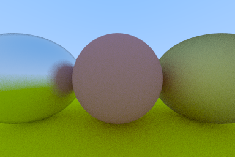
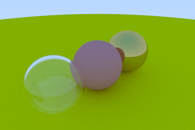
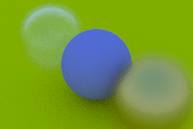
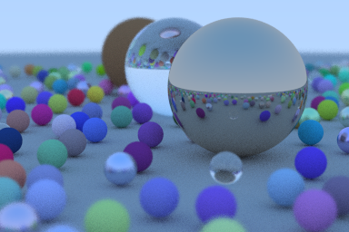

<a href="https://github.com/moddyz/RayTraincInOneWeekend/actions?query=workflow%3A%22Build+and+test%22"></a>

# RayTracingInOneWeekend

An implementation of the book [Ray Tracing in One Weekend](https://raytracing.github.io/books/RayTracingInOneWeekend.html).  

## Table of Contents

- [Dependencies](#dependencies)
- [Building](#building)
- [Programs](#programs)
  * [0. Output an Image](#0-output-an-image)
  * [1. Rays, a Simple Camera, and Background](#1-rays-a-simple-camera-and-background)
  * [2. Adding a Sphere](#2-adding-a-sphere)
  * [3. Surface Normals and Multiple Objects](#3-surface-normals-and-multiple-objects)
  * [4. Antialiasing](#4-antialiasing)
  * [5. Diffuse materials](#5-diffuse-materials)
  * [6. Metal](#6-metal)
  * [7. Dielectrics](#7-dielectrics)
  * [8. Positionable Camera](#8-positionable-camera)
  * [9. Defocus Blur](#9-defocus-blur)
  * [10. Where Next?](#10-where-next)
- [Sequels](#sequels)

### Dependencies

The following dependencies are mandatory:
- C++ compiler
- [CMake](https://cmake.org/documentation/) (3.12 or greater)

The following dependencies are optional:
- [Doxygen](https://www.doxygen.nl/index.html) and [graphviz](https://graphviz.org/) for documentation.

## Building

Example snippet for building this project:
```
mkdir build && cd build
cmake -DCMAKE_INSTALL_PREFIX="/apps/CXXTemplate/" ..
cmake --build  . -- VERBOSE=1 -j8 all install
```
CMake options for configuring this project:

| CMake Variable name     | Description                                                            | Default |
| ----------------------- | ---------------------------------------------------------------------- | ------- |
| `BUILD_DOCUMENTATION`   | Build documentation.                                                   | `OFF`   |

## Programs

### 0. Output an Image


Getting started with writing a colored gradient into an in-memory image buffer, then saving 
as a file encoded using the [PPM image format](https://en.wikipedia.org/wiki/Netpbm#PPM_example).

The [ImageBuffer](https://moddyz.github.io/RayTracingInOneWeekend/classImageBuffer.html) class and utility function [WritePPMIMage](https://moddyz.github.io/RayTracingInOneWeekend/ppmImageWriter_8h.html#a13c10c95d78b09e978f74f8688543f34) are introduced to abstract in-memory pixel storage and serialization details.

[Source code](./src/0_outputAnImage/main.cpp)

[Link to Chapter 2](https://raytracing.github.io/books/RayTracingInOneWeekend.html#outputanimage)

### 1. Rays, a Simple Camera, and Background


Setting up a basic camera model to cast the first rays into the scene.  A single ray is cast per image pixel.  

There are no objects in the scene, so the background color are used to shade each pixel, varying based on the associated ray's direction.

[Source code](./src/1_raysCameraAndBackground/main.cpp)

[Link to Chapter 4](https://raytracing.github.io/books/RayTracingInOneWeekend.html#rays,asimplecamera,andbackground)

### 2. Adding a Sphere


Adding a single object into the scene, in the form of a [Sphere](https://moddyz.github.io/RayTracingInOneWeekend/classSphere.html).  

Any rays which intersect with the sphere will provide a bright red color back to its associated pixel.  Otherwise, it will produce the background color.

[Source code](./src/2_addingASphere/main.cpp)

[Link to Chapter 5](https://raytracing.github.io/books/RayTracingInOneWeekend.html#addingasphere)

### 3. Surface Normals and Multiple Objects


Adding in support for object intersections to compute a color based on the intersection point's surface normal.  Also - adding support for multiple scene objects.  

The green ground plane behind the center sphere is in fact another sphere (much larger!), whose green shade happens to be associated with the surface normal near the top of the sphere!

[Source code](./src/3_surfaceNormalsAndMultipleObjects/main.cpp)

[Link to Chapter 6](https://raytracing.github.io/books/RayTracingInOneWeekend.html#surfacenormalsandmultipleobjects)

### 4. Antialiasing


Adding multi-sampling to produce an averaged color per pixel.  Multi-sampling is achieved by casting _multiple_ rays per-pixel, with a random factor applied to the ray direction.  A color value is accumulated by multiple rays, then averaged before pixel finalization.  

Note that compared to [3. Surface Normals and Multiple Objects](#3-surface-normals-and-multiple-objects), this image has much smoother edges, especially noticeable where the background color meets the green ground plane.

[Source code](./src/4_antialiasing/main.cpp)

[Link to Chapter 7](https://raytracing.github.io/books/RayTracingInOneWeekend.html#antialiasing)

### 5. Diffuse materials


Introduced the concept of a [Material](https://moddyz.github.io/RayTracingInOneWeekend/classMaterial.html) which can be assigned to scene objects, and more concretely, a [Lambert](https://moddyz.github.io/RayTracingInOneWeekend/classLambert.html) material.

Rays which intersect with an object with the lambert material _scatters_ rays in a random direction based on a spherical distribution above the surface normal.  This produces a smooth, diffuse apperance on the spheres.

[Source code](./src/5_diffuseMaterials/main.cpp)

[Link to Chapter 8](https://raytracing.github.io/books/RayTracingInOneWeekend.html#diffusematerials)

### 6. Metal



Introduced [Metal](https://moddyz.github.io/RayTracingInOneWeekend/classMetal.html) as an assignable material.  Metal [reflects](https://moddyz.github.io/RayTracingInOneWeekend/reflect_8h.html#ad109cf7d71820a1077469c16251e3ec9) rays, with a certain degree of randomness tunable by its fuzziness parameter.  

[Source code](./src/6_metal/main.cpp)

[Link to Chapter 9](https://raytracing.github.io/books/RayTracingInOneWeekend.html#metal)

### 7. Dielectrics


Introduced [Dieletric](https://moddyz.github.io/RayTracingInOneWeekend/classDielectric.html) as an assignable material for a glass and diamond like apperance.  Dielectric materials have the potential to _refract_ an incident ray, by allowing it to penetrate through the surface but at the same time applying a direction offset.  

For rays which come at the surface at too steep of an angle (threshold based on the refractive indices), the dielectric surface will reflect the ray.

[Source code](./src/7_dielectrics/main.cpp)

[Link to Chapter 10](https://raytracing.github.io/books/RayTracingInOneWeekend.html#dielectrics)

### 8. Positionable Camera



Adding [useful camera parameters](https://moddyz.github.io/RayTracingInOneWeekend/classCamera.html#adb1a32d5db472508d3885ef142c64e02) such as the field of view (for zooming in/out) and the ability to control the position and the point at which the camera is oriented towards (the "lookAt" point).

[Source code](./src/8_positionableCamera/main.cpp)

[Link to Chapter 11](https://raytracing.github.io/books/RayTracingInOneWeekend.html#positionablecamera)

### 9. Defocus Blur



Adding a few more camera parameters to enable the depth of field (DOF) effect.  The camera is outfitted with a virtual lens (with an adjustable aperature), and distance to _focus_ on (the focal distance).  

Both the rays origins and directions have an random applied offset which result in objects beyond the focal distance to appear blurry, taking on color values of neighbouring pixels.

[Source code](./src/9_defocusBlur/main.cpp)

[Link to Chapter 12](https://raytracing.github.io/books/RayTracingInOneWeekend.html#defocusblur)

### 10. Where Next?



A final render, with many more spheres!

[Source code](./src/10_whereNext/main.cpp)

[Link to Chapter 13](https://raytracing.github.io/books/RayTracingInOneWeekend.html#wherenext?)

## Sequels

The implementations to the sequels are available:
- [RayTracingTheNextWeek](https://github.com/moddyz/RayTracingTheNextWeek)
- [RayTracingTheRestOfYourLife](https://github.com/moddyz/RayTracingTheRestOfYourLife)

